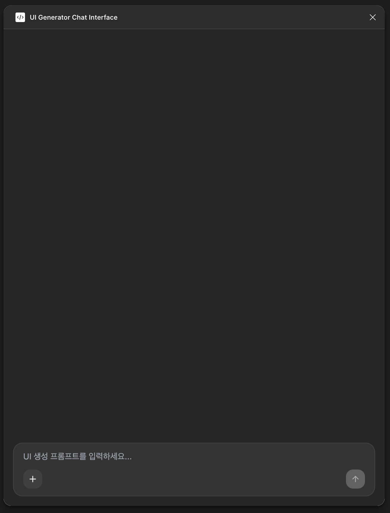
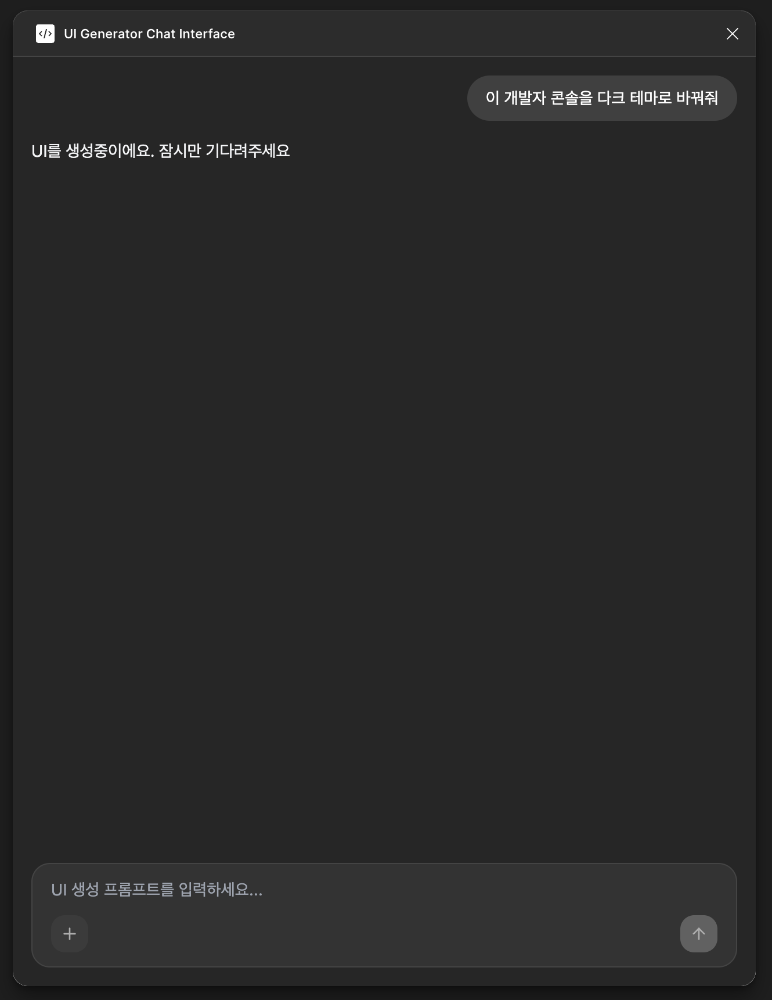
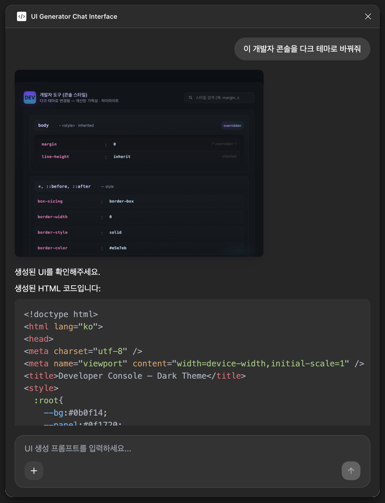

# KIXLAB UI Generator - Figma Plugin Interface

KIXLAB UI generator를 위한 피그마 플러그인 인터페이스입니다.

## 스크린샷





## 설치

```bash
npm install
```

## 빌드

```bash
npm run build
```

## 피그마 플러그인 임포트

1. 피그마에서 플러그인 메뉴 열기
2. "Development" → "Import plugin from manifest..." 선택
3. `dist/manifest.json` 파일 선택

## 기능

- **UI 생성 프롬프트 입력**: 텍스트로 UI 생성 지시사항을 입력할 수 있습니다
- **레퍼런스 이미지 추가**: + 버튼을 클릭하여 참조할 이미지를 업로드할 수 있습니다
- **이미지 미리보기**: 선택된 이미지의 이름을 확인하고 X 버튼으로 제거할 수 있습니다

## 개발 스크립트

- `npm run dev`: 개발 서버 실행
- `npm run build`: 프로덕션 빌드
